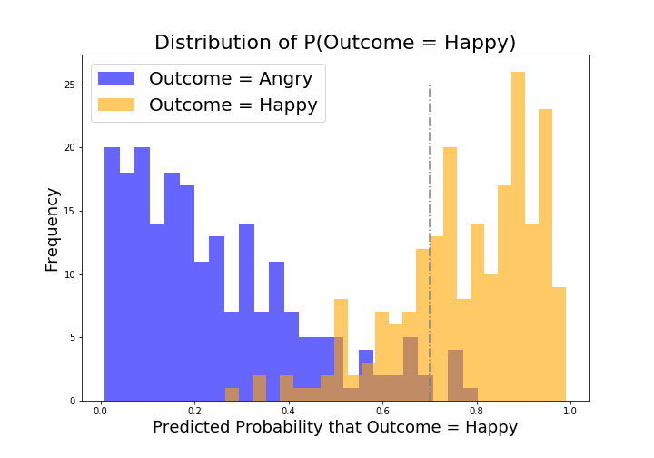
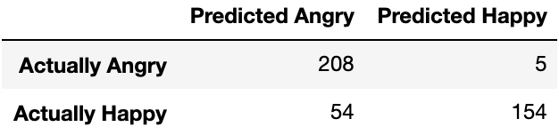

# Are your players happy? -Mac

### Problem Statement

---

As the years have gone by, player subscription to the game has dramatic decreased.  Our goal is to visit a popular subreddit r/wow of 1.3 million members to determine the current state of customer satisfaction. Since a fairly recent update to the game was implemented on Jan 14, we’ll be expecting lots of player feedback on the new content. Using posts and comments from r/happy and r/angry, we’ll categorize r/wow posts and determine the community’s current standpoint of the game.

### Executive Summary

---

Using a model, we’d like to be able to determine players’ happiness and conduct deeper studying of their comments about the current state of the game.  Since we’re working with a nonessential product, we cannot simply have a “7 out of 10 is a pass” solution. The goal will be to specialize for specificity as any customers that are not overwhelmingly happy with the game should have their opinions heard. Because of how vastly different the posts are between happy comments and angry submission, our model will be easily applicable to new products based on its simplicity and easy-to-understand strategy.

### Data dictionary

---

| Feature     | Type    | Dataset                           | Description                                                         |
|-------------|---------|-----------------------------------|---------------------------------------------------------------------|
|             |         | final.csv                         | Dataset of happy and angry posts. Our models were trained on these. |
|             |         | wow.csv                           | Dataset of WoW comments.                                            |
|             |         | final_wow.csv                     | Dataset of WoW comments with inference based on our models          |
| body        | object  | final.csv, final_wow.csv, wow.csv | These are all the texts we've collected from Reddit                 |
| subreddit   | object  | final.csv                         | The location from which the 'body' came from                        |
| log_predict | object  | final_predicts_4_models.csv       | Prediction based on logistic regression. Marker = 0.5               |
| log_proba   | float64 | final_predicts_4_models.csv       | Predicted probabilities based on logistic regression                |
| log_adjust  | object  | final_predicts_4_models.csv       | Prediction based on logistic regression. Marker = 0.7               |
| knn_predict | string  | final_predicts_4_models.csv       | Prediction based on KNearestNeighbors                               |
| re_predict  | string  | final_predicts_4_models.csv       | Prediction based on RandomForest                                    |
| bn_predict  | string  | final_predicts_4_models.csv       | Prediction based on Gaussian Naive Bayes                            

### Findings

---

By identifying happy and angry players, we can take advantage of what the community likes and dislikes and provide a game truly made for gamers. While receiving satisfactory feedback is nice, anything that doesn’t amaze the customer is a failure. So on top of us looking for the best model, we’ll be adjusting our probability of our best model so that anything under 70% is an ‘angry’ comment. We are aiming for specificity!

Our best model uses logistic regression. Which seems to have provided us with the most accurate values on our test data. By moving our determining probability value to 0.7, we can reduce our amount of false positives.  With this newly adjusted model, we then apply it to our subreddit to determine and address issues and concerns the community has raised.

Amazingly, we have reached approximately 97% specificity!

| Notable angry words | Notable happy words |
|---------------------|---------------------|
| fucking             | congratulations     |
| fuck                | happy               |
| angry               | congrats            |
| just                | thank               |
| hate                | proud               |

### Applying our model to WoW comments (finding angry posts)

---

Using our model, here are some comments that seem to share the same context with other posts from the subreddit:

"someone please tell me how the f--- balancing corruption, essences, and azerite powers is easier than just making f---ing tier sets again"

"i mean, ok, but it wouldn't have happened without the memory leak that came with 8.3. running wow shouldn't melt a $1400 laptop."

"...stop trying to hide behind "but we want the players to experience the game on the ground" etc. no, you want to gate things to keep people subscribed for longer. stop acting like these choices are based on quality gameplay. it's fine, you're a business, i get it, but stop acting like you've been altruistic in any way since wrath."

*While not all posts share the same story, some key words such as "corruption" and "8.3" are shared between many *angry* posts. Corruption is an in-game feature and 8.3 is the current patch the game is on*

### Conclusion

---

Clearly we need to improve product quality.  We do not want to melt graphics cards and put laptops out of commission! This is bad for business!  Secondly, we need to host forums aimed at current and aspiring subscribers to the game.  And this isn’t just some random idea.  On April 2016, a private server with the original(‘classic’) version of the game was shut down by Blizzard after Blizzard sent a cease and desist to their service provider.  The players, however, partook in a petition requesting Blizzard to provide a “classic” server so that they would be able to continue to enjoy and support the game they love.

Our recommendation for that is to improve our product QA and to host forums for all to attend. What makes a game is the playerbase.  It's time for you to listen to their voices!

### References
https://www.wowhead.com/news=295273/classic-triples-wow-subscription-revenue-in-august
https://www.change.org/p/mike-morhaime-legacy-server-among-world-of-warcraft-community
https://www.wowhead.com/news=295273/classic-triples-wow-subscription-revenue-in-august
https://www.change.org/p/mike-morhaime-legacy-server-among-world-of-warcraft-community
https://www.blizzard.com/en-us/company/about/
https://www.pcworld.com/article/207358/world_of_warcraft_subscribers_hit_12_million.html
